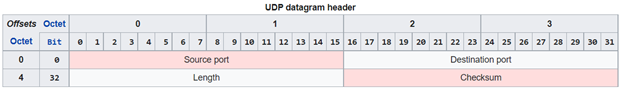
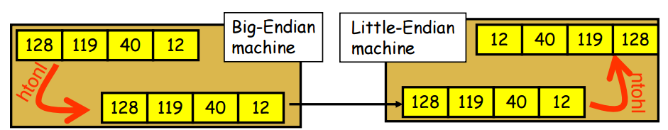

# Communication Library with UPD  

This is designed to be a general UPD api. This project provides a set of tools to allow integration between process and hosts. We give following functionality:
 
### Producer/Comsumer
- Send UPD message
  - (Producer)
  - We need to send a UDP message to given (host,port)
    - we can send byte array
    - we can packed/unpacked struts
- Consume UDP message
  - (Consumer)
  - We need to consume UDP message
    - byte array
    - packed/unpacked struct
- Mode
  - Thread to Thread
  - Process to Process

### Cleint/Server
- We need service as request reply 
  - (service mode)
- Client Side request/reply
  - (request/reply)
  - send bytes array receive byte array
  - send struct Req and Receive struct Rep  
- Mode 
  - (receive/reply to sender)
  - Thread to Thread
  - Process to Process

### Dependencies
- boost::asio
 
### Build
windows
```
cmake .. -G"Visual Studio 16 2019" -DCMAKE_TOOLCHAIN_FILE=C:/Users/e438262/dev/github/vcpkg/scripts/buildsystems/vcpkg.cmake
```
linux
```

```


```c++
    // TODO: maybe shared_ptr
    template <class SomeStruct>
    char*  Serialize(SomeStruct& s) {
        size_t size = sizeof(SomeStruct);
        char* p = (char*)&s;
        return p;
    }

    // TODO: maybe shared_ptr
    template <class SomeStruct>
    SomeStruct* DeSerialize( char* src) {
        size_t len = sizeof(SomeStruct);
        char* dest = new char[len];
        memcpy(dest, src, len);
        SomeStruct* s = (SomeStruct*)(dest);
        return s;
    }

    typedef struct example {
    uint8_t _u8;
    uint16_t _u16;
    uint32_t _u32;
    char matrix[100][200];
    } Test;

    TEST_CASE("Serializer Test ", "_1") {
        Test test;
        test._u8 = 1;
        test._u16 = 2;
        test._u32 = 3;
        char*   t = lm::spp::Serialize(test);
        Test* test2 = lm::spp::DeSerialize<Test>(t);
        REQUIRE(test._u8 == test2->_u8);
        REQUIRE(test._u16 == test2->_u16);
        REQUIRE(test._u32 == test2->_u32);
    }
```
 

### UDP

UDP is connectionless: 
- Means make no efforts to validate delivery ... etc
---
Thus:
- Unreliable  – cannot be known if it will reach its destination
- Not ordered – cannot be guaranteed.
- Lightweight – as consequence 
- Datagrams –  the read operation at the receiver socket will yield an entire message as it was originally sent.
---
- Broadcasts – UDP can broadcast - sent packets can be addressed to be receivable by all devices on the subnet.
- Multicast – a multicast mode of operation is supported whereby a single datagram packet can be automatically routed without duplication to a group of subscribers.
---

- 

- Source port number
  - identifies the sender's port
  - assumed to be the port to reply to if needed. 
 - Destination port number 
   - identifies the receiver's port and is required. 
 - Length
   - specifies the length in bytes of the UDP header and UDP data. 
   - minimum length is 8 bytes, the length of the header. 
   - limit of 65,535 bytes (8-byte header + 65,527 bytes of data) for a UDP datagram.
   - However, the actual limit for the data length, which is imposed by the underlying IPv4 protocol, is 65,507 bytes (65,535 bytes − 8-byte UDP header − 20-byte IP header) 
- Checksum 
  - The checksum field may be used for error-checking of the header and data. 
  - optional in IPv4
  - mandatory in IPv6
  - The field carries all-zeros if unused 

 
 
For completeness IP4 header:

 

This convention, known as network byte order, defines the bit-order of network addresses 
as they pass through the network. The TCP/IP standard network byte order is big-endian. 
In order to participate in a TCP/IP network, little-endian systems usually bear the burden 
of conversion to network byte order.

---
## Little and Big Endian
 A big-endian system stores the most significant byte of a word at the smallest memory address and the least significant byte at the largest. 
- little-endian: lower bytes first
- big-endian: higher bytes first 

Suppose integer is stored as 4 bytes then a variable x with value 0x01234567 will be stored 
as following.


- x86: LE 
- arm: LE 

### What happens when little and big endian machine communicate each other ?

Solution: Network Byte Ordering
- Host Byte-Ordering: the byte ordering used by a host (big or little)
- Network Byte-Ordering: the byte ordering used by the network –always big-endian

- u_long htonl(u_long x);
- u_short htons(u_short x);
- u_long ntohl(u_long x);
- u_short ntohs(u_short x);

- On big-endian machines, these routines do nothing but on little-endian machines, they reverse the byte order



```
        bool IsLittleIndian() {
            // 00000000 00000000 00000000 00000001 BE
            // 00000001 00000000 00000000 00000000 LE
            unsigned int x = 1;
            char* c = (char*)&x;
            return *c ? true : false;
        }
        bool IsBigIndian() {
            return !IsLittleIndian();
        }

        Based on compiler if integer size is 4 byte then :
        x in binary format
        (Big Endian):     00000000 00000000 00000000 00000001 
        (Little Endian) : 00000001 00000000 00000000 00000000
```

---
## What is a "packed" structure 

When structures are defined, the compiler is allowed to add paddings (spaces without actual data) so that members fall in address boundaries that are easier to access for the CPU.

```
struct S {
    int16_t member1;
    int32_t member2;
};

The structure in memory of the above structure in a 32-bit architecture is (~ = padding):

+---------+---------+
| m1 |....|   m2    |
+---------+---------+
```
The same structure, when packed, will appear in memory as something like:
```
+----+----------+
| m1 |    m2    |
+----+----------+
```

---
### Synchronous UDP Client 

- Acts as a client in the client-server communication model
- Communicates with the server application using UDP
- Uses I/O that block the thread
    - execution until the corresponding operation completes
    - or an error occurs

### Functionaly

- Given IP-address(s) and port(s) number 
- Allocate a UDP socket.
- Exchange messages with the servers.
- Deallocate the socket.


 # PGM
- The PGM format is a lowest common denominator grayscale file format.
- PGM image can just be thought of an array of arbitrary integers
- Characters from a "#" to the next end-of-line are ignored 

# PGMA ASCII PGM (Portable Gray Map)
```
        P2
        # feep.ascii.pgm
        24 7
        15
        0 0  0  0  0  0  0  0  0 0  0  0  0  0  0  0  0 0  0  0  0  0  0  0
        0 3  3  3  3  0  0  7  7 7  7  0  0 11 11 11 11 0  0 15 15 15 15  0
        0 3  0  0  0  0  0  7  0 0  0  0  0 11  0  0  0 0  0 15  0  0 15  0
        0 3  3  3  0  0  0  7  7 7  0  0  0 11 11 11  0 0  0 15 15 15 15  0
        0 3  0  0  0  0  0  7  0 0  0  0  0 11  0  0  0 0  0 15  0  0  0  0
        0 3  0  0  0  0  0  7  7 7  7  0  0 11 11 11 11 0  0 15  0  0  0  0
        0 0  0  0  0  0  0  0  0 0  0  0  0  0  0  0  0 0  0  0  0  0  0  0
```
- the typical file extension is ".pgm", but an extension of ".pnm" is also occasionally used.
- magic number for identifying the file type
- whitespace
- width formatted as ASCII characters in decimal.
- whitespace
- height again in ASCII decimal.
- max grey value again in ASCII decimal.
- single white space char usually new line
- raster rows of height in order top to botton
  - each in ASCII decimal
  - between 0 and the specified maximum value
  - separated by whitespace, 
  - starting at the top-left corner of the graymap
  - proceeding in normal English reading order

  # PGMB, a data directory which describes binary PGM (Portable Gray Map) files.
- the typical file extension is ".pgm", but an extension of ".pnm" is also occasionally used.
- A "magic number" for identifying the file type. A binary PGM file's magic number is the two characters "P5".
- Whitespace (blanks, TABs, CRs, LFs).
- A width, formatted as ASCII characters in decimal.
- Whitespace.
- A height, again in ASCII decimal.
- Whitespace.
- The maximum gray value, MAXVAL, again in ASCII decimal. MAXVAL must be between 0 and 255.
- A single character of whitespace, typically a newline;
- Width * height gray values, each stored as a plain byte, 
- between 0 and the specified maximum value, 
- separated by whitespace, 
- starting at the top-left corner of the graymap, 
- proceeding in normal English reading order. 
- A value of 0 means black, and the maximum value means white.
- Characters from a "#" to the next end-of-line are ignored (comments).


---

### GigE Vision
- Interface standard high-performance cameras. 
- Provides a framework for 
  - transmitting high-speed video
  - related control data over Ethernet networks.
- require the payment of annual licensing fees 

### GigE Vision has four main elements:

- GigE Vision Control Protocol (GVCP)—Runs on the UDP protocol. 
- The standard defines how to control and configure devices. 
- Specifies stream channels and the mechanisms of sending image and configuration data between cameras and computers.
- GigE Vision Stream Protocol (GVSP)—Runs on the UDP protocol. 
- Covers the definition of data types and the ways images can be transferred via GigE.
- GigE Device Discovery Mechanism—Provides mechanisms to obtain IP addresses.
- XML description file based on a schema defined by the European Machine Vision Association's GenICam  


-DCMAKE_TOOLCHAIN_FILE=/Users/overman/dev/github/vcpkg/scripts/buildsystems/vcpkg.cmake